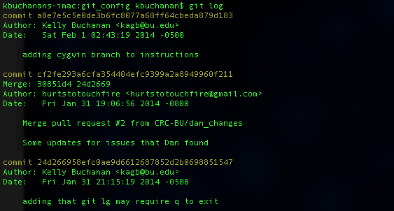
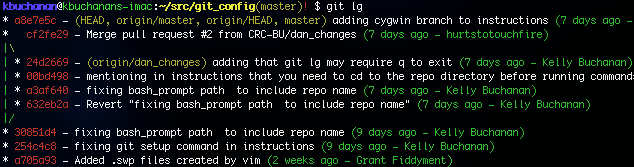
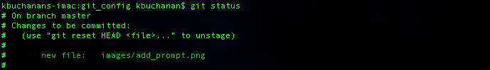
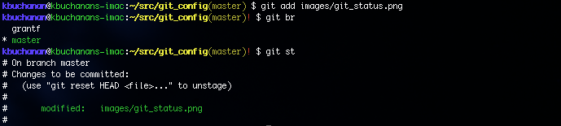
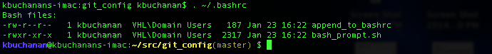

Improvements this repo provides
===============================

In practice, most software developers use some [syntactic sugar](http://en.wikipedia.org/wiki/Syntactic_sugar) to help ease their use of git and GitHub. If you're using git on the command line (as opposed to with a GUI client), we recommend that you adopt these config files as a starting point. These files will provide you with branch information on the bash prompt as well as some convenient aliases for commands that you'll need to use on a regular basis.

Examples
------------
Standard git log shows the commit history:



With configs, the log is more compact, color-coded, and shows the branching structure:



Standard bash prompt shown, must use git branch command to check current branch and git status to check for uncommitted changes:



With configs, bash prompt shows current branch and a red flag for uncommitted changes:




Installation
============

This assumes you've done nothing to set up git beyond registering a Github account and getting added to the org, and that you are running Mac OS or a Linux variant with a bash terminal. Windows users can running cygwin can use these configs as well. Note that Windows users & their collaborators may experience [issues with line ending conversion](https://github.com/hurtstotouchfire/git_config/issues/4).

Install git
------------

Mac: I recommend using [homebrew](http://brew.sh/)
```
brew install git
```
Linux: your package manager of choice, in my case apt
```
sudo apt-get install git
```

Clone this repo
----------------
I keep all of my git repos in one directory: `~/src`, but you can put this wherever you want. Since you should keep it and pull occasionally for bug fixes and updates, you might want to just clone it right in your home directory. Cloning will make a subdirectory and pull all the contents of this repo into it.

```
cd ~/
git clone git@github.com:hurtstotouchfire/git_config.git
```
Add prompt configuration to your bashrc
---------------------------------------
Since nearly every machine has one already, I assumed that appending would be the easiest option for everyone. If you don't have a file at `~/.bashrc`, you can just copy `append_to_bashrc` into your home directory. Just add `#!/bin/bash` on the first line of the file. The only thing to change in this text is that you have to change `dot_dir` to the directory where you cloned this repo.

After saving this, you can open a new terminal, or re-source your bashrc (run: `. ~/.bashrc`) to see the effects. This will color your prompt (colors can be configured in the script), and if you cd into the git_config directory we just cloned, you should see the branch "master" listed in the prompt.



Running git setup script
------------------------

The git setup script `git_setup.sh` is written to be run multiple times if needed, and it's very conservative so it won't destroy any existing files. You can pretty much just run it, and you should run it once on each machine you clone this repo on.

From the git_config directory you can run:
```
sh git_setup.sh `pwd`
```
You will be prompted to enter your name and email. Note that this config file currently provides a default text editor of emacs, so if you want to change that, you can run an additional command after running this script:
```
git config --global core.editor vim
```

Committing changes to your own branch in this repo
--------------------------------------------------
After running the git setup script, you will actually have changed values in the `gitconfig` file in this repo, so you should probably create your own branch and commit them. It's good practice. 

Change into the git_config directory (`cd git_config`). If you've already installed the bash prompt and you've just run the git setup script you should see a red exclamation point after the branch name on your command prompt indicating that you have made uncommitted changes to the repository. 

The following steps will introduce all of the aliases in this configuration and allow you to add your own branch to this repo. 

1. Look at the changes you've made by running `git diff`.
2. Let's stow those away for now: `git stash`
3. Make yourself a new branch: `git nb yourname`
4. Apply your changes: `git stash apply`
5. See what changes can be committed: `git st`
6. Commit your changes: `git cam "write a brief description here"`
7. View the commit history: `git lg` (you may need to enter `q` to exit this list)
8. You should see the exclamation mark disappear since you have no uncommitted changes now.
9. Check the status of your branch again: `git st`
10. Push this branch for the first time: `git fpush`

In the future, any commits to this branch can be pushed using simply `git push`.

Additional Resources
=====================
- [comprehensive git documentation](http://git-scm.com/docs)
- [git command diagram / cheatsheet](http://ndpsoftware.com/git-cheatsheet.html)
- [git desktop application](http://guides.github.com/overviews/desktop/)
- [intro to branching workflows](http://guides.github.com/overviews/flow/)
